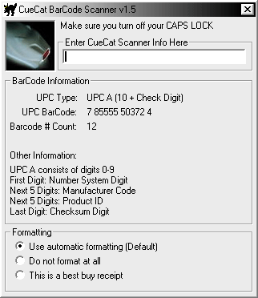



## CueCat Barcode Decoder v1\.5

### Description

Decodes CueCat barcode Data into readable Barcode alphanumerics. This is the modified v1.5 which detects barcode types and has cleaner code. The CueCat is a Free barcode reader available at Radio Shack and getcat.com/digitalconvergence.com.
 
### More Info
 
Encrypted Cuecat Code

You must have a CueCat Barcode Reader free from any Radio Shack.

Deciphered Barcode

             |
---                |---
**Submitted On**   |2000-08-29 16:20:58
**By**             |[Alex Skinner](https://github.com/Planet-Source-Code/PSCIndex/blob/master/ByAuthor/alex-skinner.md)
**Level**          |Intermediate
**User Rating**    |4.8 (29 globes from 6 users)
**Compatibility**  |VB 4\.0 \(32\-bit\), VB 5\.0, VB 6\.0
**Category**       |[Complete Applications](https://github.com/Planet-Source-Code/PSCIndex/blob/master/ByCategory/complete-applications__1-27.md)
**World**          |[Visual Basic](https://github.com/Planet-Source-Code/PSCIndex/blob/master/ByWorld/visual-basic.md)
**Archive File**   |[CODE\_UPLOAD94128292000\.zip](https://github.com/Planet-Source-Code/alex-skinner-cuecat-barcode-decoder-v1-5__1-11037/archive/master.zip)

